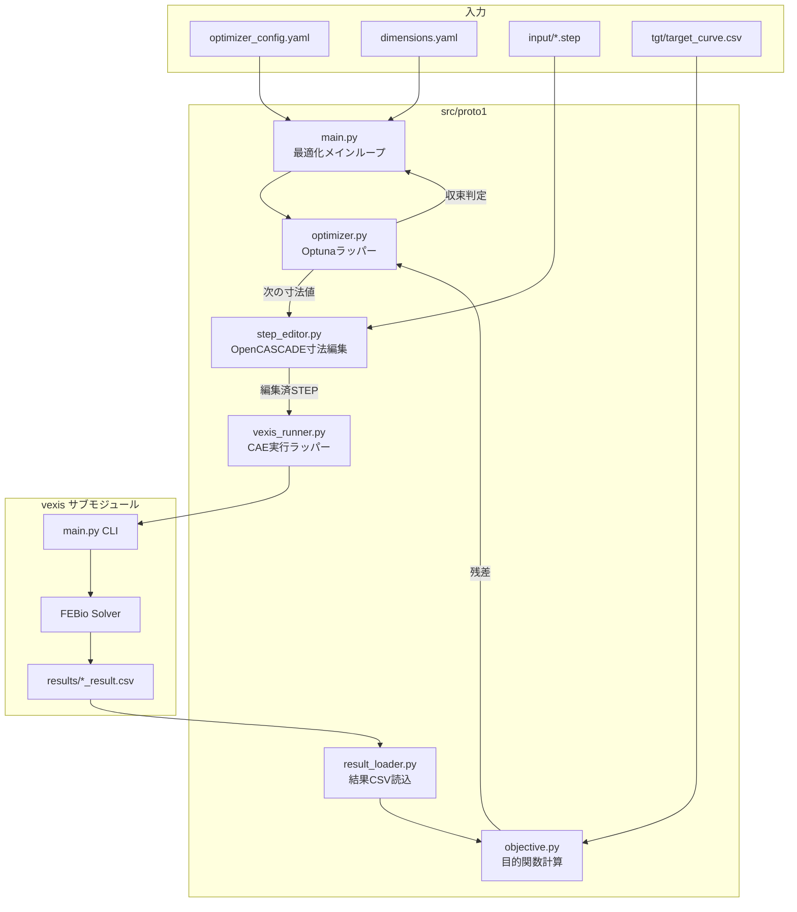

# Proto1 最適化システム設計書

## 1. 概要

Proto1は、VEXIS CAEソルバーを用いたラバードーム形状の自動最適化プロトタイプです。
STEPファイルの寸法を変数として、解析結果の反力-変位カーブをターゲットカーブに合わせ込む最適化を行います。

### 1.1 主要機能

- **完全自動化**: 人間の介在なく、最適化ループを自動実行
- **詳細ロギング**: 検証のための詳細なログファイル出力
- **多目的最適化**: カーブ全体の一致度＋特徴量（ピーク値など）を同時最適化
- **柔軟な設定**: YAML設定ファイルによるパラメータ管理

---

## 2. システムアーキテクチャ



---

## 3. ディレクトリ構成

```
optuna-for-vexis/
├── src/
│   └── proto1/
│       ├── main.py              # エントリポイント
│       ├── step_editor.py       # OpenCASCADEによる寸法編集
│       ├── vexis_runner.py      # VEXISサブモジュール呼び出し
│       ├── result_loader.py     # 結果CSV読込・解析
│       ├── objective.py         # 目的関数・残差計算
│       ├── optimizer.py         # Optunaラッパー
│       └── utils.py             # ユーティリティ関数
│
├── config/
│   ├── optimizer_config.yaml    # 最適化設定
│   └── dimensions.yaml          # 寸法定義リスト
│
├── tgt/
│   └── target_curve.csv         # ターゲット反力-変位カーブ
│
├── input/                       # 入力STEPファイル
├── output/                      # 最適化結果出力
├── temp/                        # 中間ファイル
├── devlog/                      # 開発ログ
└── vexis/                       # サブモジュール（変更しない）
```

---

## 4. 設定ファイル仕様

### 4.1 optimizer_config.yaml

```yaml
# 最適化設定ファイル
optimization:
  # サンプラー: "TPE" | "GP" | "NSGAII" | "Random"
  sampler: "TPE"
  
  # 最大試行回数
  max_trials: 100
  
  # 収束判定: この残差以下で終了
  convergence_threshold: 0.01
  
  # 各解析前に待機するCAE試行数（逐次/バッチ）
  # 1 = 毎回最適化, N = N回解析後に最適化
  batch_size: 1

objective:
  # 目的関数
  # "rmse": カーブ全体のRMSE
  # "multi": RMSE + 特徴量の多目的最適化
  type: "multi"
  
  # 多目的最適化時の重み
  weights:
    rmse: 1.0         # カーブ全体の一致度
    peak_force: 0.5   # ピーク荷重の誤差
    stiffness: 0.3    # 初期剛性の誤差

  # 特徴量抽出設定
  features:
    peak_force:
      type: "max"        # 最大値
      column: "force"
    stiffness:
      type: "slope"      # 初期傾き
      range: [0.0, 0.2]  # 変位0-0.2mm区間

logging:
  # ログレベル: DEBUG, INFO, WARNING, ERROR
  level: "INFO"
  
  # ログファイル出力先
  output_dir: "output/logs"

paths:
  # ターゲットカーブファイル
  target_curve: "tgt/target_curve.csv"
  
  # 結果出力ディレクトリ
  result_dir: "output"
  
  # VEXISサブモジュールパス
  vexis_path: "vexis"
```

### 4.2 dimensions.yaml

```yaml
# 寸法定義ファイル
# 各寸法は最適化変数として扱われる

dimensions:
  - name: "dome_height"
    description: "ドーム高さ"
    type: "float"
    min: 1.5
    max: 3.0
    initial: 2.0
    unit: "mm"
    # STEPファイル内での参照方法
    step_reference:
      # 方式: "coordinate" | "parameter" | "face_id"
      method: "coordinate"
      axis: "Z"           # 座標軸
      face_filter: "top"  # 対象面の絞り込み

  - name: "wall_thickness"
    description: "壁厚"
    type: "float"
    min: 0.2
    max: 0.8
    initial: 0.4
    unit: "mm"
    step_reference:
      method: "offset"    # オフセット距離として定義
      base_face: "outer"
      target_face: "inner"

  - name: "fillet_radius"
    description: "フィレット半径"
    type: "float"
    min: 0.1
    max: 0.5
    initial: 0.2
    unit: "mm"
    step_reference:
      method: "edge_fillet"
      edge_filter: "dome_base"
```

---

## 5. モジュール詳細設計

### 5.1 main.py - エントリポイント

```python
"""
Proto1 最適化メインループ

Usage:
    python -m src.proto1.main --config config/optimizer_config.yaml
"""

def main():
    # 1. 設定ファイル読込
    # 2. Optunaスタディ作成
    # 3. 最適化ループ実行
    # 4. 結果出力
    pass
```

**機能**:
- コマンドライン引数解析
- 設定ファイル読込
- 最適化ループの制御
- 収束判定
- 結果レポート生成

### 5.2 step_editor.py - OpenCASCADE寸法編集

```python
"""
OpenCASCADEを使用したSTEPファイル寸法編集

Dependencies:
    - pythonocc-core (OpenCASCADE Python binding)
"""

class StepEditor:
    def load(self, step_path: str) -> None:
        """STEPファイル読込"""
        pass
    
    def set_dimension(self, name: str, value: float) -> None:
        """指定寸法の値を設定"""
        pass
    
    def save(self, output_path: str) -> None:
        """編集済STEPファイル保存"""
        pass
```

**実装方針**:
- `pythonocc-core` を使用
- 寸法編集は座標変換（スケーリング/移動）で実現
- 元のSTEPファイルは変更せず、temp/に編集済ファイルを出力

### 5.3 vexis_runner.py - CAE実行ラッパー

```python
"""
VEXISサブモジュールのCLIラッパー
"""

class VexisRunner:
    def run_analysis(self, step_path: str, job_name: str) -> str:
        """
        CAE解析を実行
        
        Returns:
            結果CSVファイルのパス
        """
        # vexis/main.py を subprocess で呼び出し
        pass
```

**実装方針**:
- `subprocess` でVEXIS CLIを呼び出し
- VEXISの `input/` に一時的にSTEPファイルをコピー
- 解析完了を待機し、結果CSVパスを返す
- **サブモジュールへの変更は行わない**

### 5.4 result_loader.py - 結果読込

```python
"""
解析結果CSVの読込と解析
"""

class ResultLoader:
    def load_curve(self, csv_path: str) -> pd.DataFrame:
        """反力-変位カーブ読込"""
        pass
    
    def extract_features(self, df: pd.DataFrame, config: dict) -> dict:
        """特徴量抽出（ピーク荷重、剛性など）"""
        pass
```

**VEXISの結果フォーマット** (`{name}_result.csv`):
- 列: `displacement`, `force` (または類似)
- 単位: mm, N

### 5.5 objective.py - 目的関数

```python
"""
最適化目的関数
"""

def calculate_rmse(result: pd.DataFrame, target: pd.DataFrame) -> float:
    """RMSE計算（補間で点数を揃える）"""
    pass

def calculate_objectives(
    result: pd.DataFrame,
    target: pd.DataFrame,
    config: dict
) -> dict[str, float]:
    """
    多目的最適化用の目的関数値計算
    
    Returns:
        {"rmse": 0.05, "peak_force_error": 0.02, ...}
    """
    pass
```

### 5.6 optimizer.py - Optunaラッパー

```python
"""
Optuna最適化エンジンラッパー
"""

class Optimizer:
    def __init__(self, config: dict, dimensions: list):
        # サンプラー選択（TPE/GP/NSGAII）
        # スタディ作成
        pass
    
    def suggest_params(self) -> dict:
        """次の試行パラメータを提案"""
        pass
    
    def report_result(self, trial_id: int, objectives: dict):
        """試行結果を報告"""
        pass
    
    def is_converged(self) -> bool:
        """収束判定"""
        pass
```

**Optunaサンプラー対応**:
- `TPESampler`: デフォルト、効率的な探索
- `GPSampler`: ガウス過程ベイズ最適化
- `NSGAIISampler`: 多目的最適化向け

---

## 6. 処理フロー

```mermaid
sequenceDiagram
    participant Main as main.py
    participant Opt as Optimizer
    participant Edit as StepEditor
    participant Run as VexisRunner
    participant Load as ResultLoader
    participant Obj as Objective

    Main->>Main: 設定読込
    Main->>Opt: スタディ作成
    
    loop 最適化ループ
        Opt->>Main: 次の寸法値を提案
        Main->>Edit: STEPファイル編集
        Edit->>Edit: 寸法値を適用
        Edit->>Main: 編集済STEPパス
        
        Main->>Run: CAE解析実行
        Run->>Run: vexis/main.py呼出
        Run->>Main: 結果CSVパス
        
        Main->>Load: 結果読込
        Load->>Main: 反力-変位データ
        
        Main->>Obj: 目的関数計算
        Obj->>Main: 残差値
        
        Main->>Opt: 結果報告
        
        alt 収束条件達成
            Main->>Main: ループ終了
        end
    end
    
    Main->>Main: 最終レポート出力
```

---

## 7. ログ仕様

### 7.1 ログファイル構成

```
output/logs/
├── optimization_YYYYMMDD_HHMMSS.log   # メインログ
├── trial_001/
│   ├── step_edit.log                   # 寸法編集ログ
│   ├── vexis_run.log                   # CAE実行ログ
│   └── objective.log                   # 目的関数計算ログ
├── trial_002/
│   └── ...
└── summary.json                        # 最適化サマリ
```

### 7.2 サマリJSON形式

```json
{
  "start_time": "2026-01-21T11:00:00",
  "end_time": "2026-01-21T15:30:00",
  "total_trials": 50,
  "best_trial": {
    "trial_id": 42,
    "parameters": {
      "dome_height": 2.35,
      "wall_thickness": 0.45
    },
    "objectives": {
      "rmse": 0.008,
      "peak_force_error": 0.015
    }
  },
  "convergence_achieved": true
}
```

---

## 8. 依存ライブラリ

```
# requirements.txt (proto1用)
optuna>=3.0
pythonocc-core>=7.7  # OpenCASCADE
pandas>=2.0
numpy>=1.24
scipy>=1.10          # 補間処理
pyyaml>=6.0
tqdm>=4.65
```

---

## 9. VEXISサブモジュールとの連携

### 9.1 最小限の連携方針

VEXISサブモジュールへの変更は**一切行わない**。以下の方法で連携：

1. **入力**: STEPファイルを `vexis/input/` にコピー
2. **実行**: `python vexis/main.py` をsubprocessで呼び出し
3. **出力**: `vexis/results/{name}_result.csv` を読込

### 9.2 VEXISの設定

VEXISの `config/config.yaml` を事前に適切に設定しておく必要がある：
- `total_stroke`: 適切な押込量
- `material_name`: 使用材料
- `time_steps`: シミュレーションステップ数

---

## 10. 今後の課題・拡張案

1. **並列実行**: 複数CAEジョブの同時実行（現在は未対応）
2. **再開機能**: 中断した最適化の再開
3. **可視化**: リアルタイム進捗グラフ
4. **パラメトリックSTEP**: フィーチャーベースの寸法編集

---

## 11. 検証計画

### 11.1 単体テスト

各モジュールの単体テストを`test/proto1/`に配置：

```bash
python -m pytest test/proto1/ -v
```

### 11.2 統合テスト

サンプルSTEPファイルとターゲットカーブを用いた統合テスト：

```bash
python -m src.proto1.main --config config/optimizer_config.yaml --max-trials 5
```

### 11.3 手動検証

1. 出力されたログファイルの確認
2. 最適化結果グラフとターゲットカーブの視覚的比較
3. 収束グラフの確認

---

*Document Version: 1.0*
*Created: 2026-01-21*
