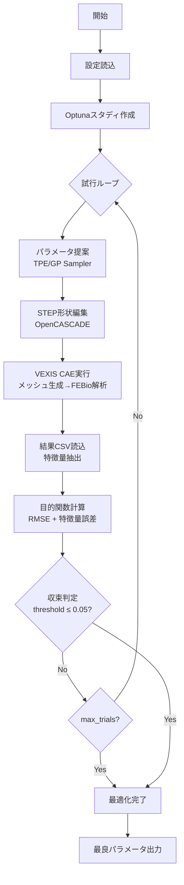

# Proto1 最適化システム - 処理フローと機能説明

## 概要

Proto1は**Optunaベイズ最適化**と**VEXIS CAE解析**を組み合わせた自動形状最適化システムです。  
ラバードームの荷重-変位特性をターゲットカーブに一致させるため、形状パラメータを自動調整します。

---

## システム構成

```
optuna-for-vexis/
├── src/proto1/           # 最適化エンジン
│   ├── main.py           # エントリポイント
│   ├── optimizer.py      # Optunaラッパー
│   ├── step_editor.py    # STEP形状編集
│   ├── vexis_runner.py   # CAE実行制御
│   ├── result_loader.py  # 結果CSV読込
│   └── objective.py      # 目的関数計算
├── config/
│   ├── dimensions.yaml   # 寸法変数定義
│   └── optimizer_config.yaml  # 最適化設定
├── vexis/                # CAEサブモジュール
├── input/                # 入力STEP・ターゲットCSV
└── output/               # 最適化結果
```

---

## 処理フロー



---

## 各モジュールの機能

### 1. `main.py` - エントリポイント

| 機能           | 説明                                              |
| -------------- | ------------------------------------------------- |
| 設定読込       | `dimensions.yaml`, `optimizer_config.yaml` を解析 |
| ターゲット設定 | ターゲットCSVから特徴量を抽出                     |
| 最適化実行     | Optimizerを通じてOptuna試行を制御                 |
| シグナル処理   | Ctrl+Cでのグレースフル停止                        |

**使用方法:**
```bash
python -m src.proto1.main --max-trials 30 --verbose
```

**オプション:**
| フラグ         | 説明                           |
| -------------- | ------------------------------ |
| `--config`     | 設定ファイルパス               |
| `--max-trials` | 最大試行回数（設定値を上書き） |
| `--threshold`  | 収束閾値                       |
| `--verbose`    | デバッグログ出力               |

---

### 2. `optimizer.py` - Optunaラッパー

Optunaの探索アルゴリズムを抽象化し、設定に応じたサンプラーを選択します。

**対応サンプラー:**
| 名前     | アルゴリズム                     | 特徴               |
| -------- | -------------------------------- | ------------------ |
| `TPE`    | Tree-structured Parzen Estimator | デフォルト、高速   |
| `GP`     | ガウス過程                       | 少数試行向け       |
| `NSGAII` | 遺伝的アルゴリズム               | 多目的最適化       |
| `RANDOM` | ランダム                         | ベースライン比較用 |

**主要メソッド:**
```python
optimizer.suggest_params(trial)    # パラメータ提案
optimizer.run_optimization(func)   # 最適化ループ実行
optimizer.get_best_params()        # 最良パラメータ取得
optimizer.is_converged(threshold)  # 収束判定
```

---

### 3. `step_editor.py` - STEP形状編集

OpenCASCADE (pythonocc-core) を使用してSTEPファイルの形状を変換します。

**対応変換方式:**
| method          | 説明                | 使用例         |
| --------------- | ------------------- | -------------- |
| `scale_z`       | Z軸方向スケーリング | ドーム高さ調整 |
| `scale_uniform` | 均一スケーリング    | 全体サイズ変更 |
| `coordinate`    | 軸方向座標変換      | 径方向調整     |

**処理例:**
```python
editor = StepEditor()
editor.load("input/example_1.stp")
editor.apply_dimensions({
    "height_scale": 1.05,
    "overall_scale": 0.95,
    "radial_scale": 1.02
}, dim_configs)
editor.save("temp/trial_xxx.step")
```

---

### 4. `vexis_runner.py` - CAE実行制御

VEXISサブモジュールをサブプロセスとして呼び出し、解析を実行します。

**実行フロー:**
1. 編集済みSTEPをVEXIS/inputにコピー
2. `python vexis/main.py` をサブプロセス実行
3. メッシュ生成 → FEBio解析 → 結果CSV出力
4. 結果ファイルパスを返却

**エラーハンドリング:**
- タイムアウト監視（デフォルト30分）
- グレースフルシャットダウン
- エラーパターン検出

---

### 5. `result_loader.py` - 結果読込・特徴量抽出

CAE解析結果CSVを読込み、荷重-変位カーブと特徴量を抽出します。

**対応特徴量タイプ:**
| type            | 説明             | 例           |
| --------------- | ---------------- | ------------ |
| `max`           | 最大値           | ピーク荷重   |
| `slope`         | 指定範囲の傾き   | 初期剛性     |
| `peak_position` | ピーク位置の変位 | クリック位置 |
| `value_at`      | 指定変位での値   | 特定点の荷重 |

---

### 6. `objective.py` - 目的関数計算

ターゲットカーブとの一致度を数値化します。

**目的関数:**
```
weighted_score = w_rmse × RMSE 
               + w_peak × |peak_error| 
               + w_stiff × |stiffness_error|
```

| 関数                         | 説明                         |
| ---------------------------- | ---------------------------- |
| `calculate_rmse()`           | カーブ全体のRMSE（補間比較） |
| `calculate_feature_errors()` | 各特徴量の相対誤差           |
| `is_converged()`             | 閾値以下で収束判定           |

---

## 設定ファイル

### `dimensions.yaml` - 寸法変数定義

```yaml
dimensions:
  - name: "height_scale"
    description: "ドーム高さのスケールファクター"
    type: "float"
    min: 0.8
    max: 1.2
    initial: 1.0
    step_reference:
      method: "scale_z"
      axis: "Z"
```

### `optimizer_config.yaml` - 最適化設定

```yaml
optimization:
  sampler: "TPE"
  max_trials: 30
  convergence_threshold: 0.05

objective:
  weights:
    rmse: 1.0
    peak_force: 0.3
    stiffness: 0.2
```

---

## 実行例

```bash
# 標準実行（30試行）
python -m src.proto1.main

# 試行数を指定
python -m src.proto1.main --max-trials 50

# デバッグモード
python -m src.proto1.main --max-trials 5 --verbose

# 収束閾値を変更
python -m src.proto1.main --threshold 0.03
```

**出力例:**
```
[INFO] 最適化完了
[INFO] 試行回数: 2
[INFO] 最良パラメータ: {'height_scale': 1.039, 'overall_scale': 0.931, 'radial_scale': 0.897}
[INFO] 最良目的関数値: 0.0382
[INFO] 収束達成: True
```

---

## 依存関係

| パッケージ        | 用途                              |
| ----------------- | --------------------------------- |
| `optuna`          | ベイズ最適化フレームワーク        |
| `pythonocc-core`  | OpenCASCADE Python バインディング |
| `numpy`, `pandas` | 数値計算・データ処理              |
| `scipy`           | 補間・最適化ユーティリティ        |
| `tqdm`            | 進捗表示                          |
| `pyyaml`          | 設定ファイル解析                  |

---

## 注意事項

1. **Python環境**: proto1とVEXISは同一の`.venv`を使用
2. **CAE解析時間**: 1試行あたり約5-10分
3. **ストレージ**: Optunaの試行履歴は`optuna_study.db`に保存
4. **中断再開**: 同一study名で再実行すると履歴から継続

---

*Last Updated: 2026-01-21*
