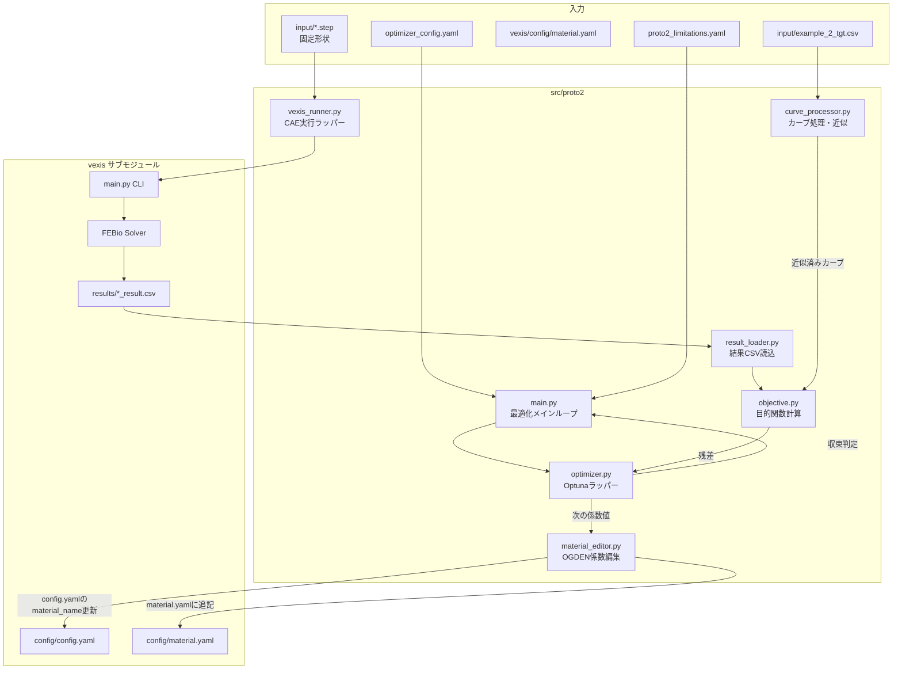

# Proto2 材料モデル係数最適化システム設計書

## 1. 概要

Proto2は、VEXIS CAEソルバーを用いたOGDEN材料モデル係数の自動最適化プロトタイプです。
実機の反力-変位カーブ（ターゲットカーブ）にCAE解析結果を合わせ込むことで、材料モデルを同定します。

### 1.1 Proto1との違い

| 項目             | Proto1             | Proto2                       |
| ---------------- | ------------------ | ---------------------------- |
| 最適化対象       | STEPファイルの寸法 | OGDEN材料モデル係数          |
| 入力形状         | 可変（STEP編集）   | 固定（編集なし）             |
| ターゲットカーブ | CAEマスターカーブ  | 実機測定カーブ               |
| CAE範囲          | マスターカーブ全体 | マスターカーブより小さな範囲 |

### 1.2 主要機能

- **OGDEN係数最適化**: c, m, t, gの各配列（各6要素）を最適化
- **係数選択オプション**: c,mのみ / t,gのみ / 全係数（デフォルト）
- **カーブ近似**: ノイズを含む実機データを多項式で近似（将来実装）
- **部分範囲最適化**: CAE解析範囲内のみでカーブを比較

---

## 2. システムアーキテクチャ



---

## 3. ディレクトリ構成

```
optuna-for-vexis/
├── src/
│   ├── proto1/                      # Proto1（寸法最適化）
│   └── proto2/
│       ├── main.py                  # エントリポイント
│       ├── material_editor.py       # OGDEN係数編集
│       ├── vexis_runner.py          # CAE実行ラッパー（Proto1流用）
│       ├── result_loader.py         # 結果CSV読込（Proto1流用）
│       ├── objective.py             # 目的関数計算（Proto1流用）
│       ├── optimizer.py             # Optunaラッパー（Proto1流用）
│       ├── curve_processor.py       # カーブ処理・多項式近似
│       └── utils.py                 # ユーティリティ関数
│
├── config/
│   ├── optimizer_config.yaml        # 最適化設定（Proto1と共通）
│   └── proto2_limitations.yaml      # Proto2用係数範囲設定
│
├── input/                           # 入力ファイル
│   ├── *.step                       # 固定形状ファイル
│   └── example_2_tgt.csv            # ターゲットカーブ（実機データ）
│
├── output/                          # 最適化結果出力
│   └── optimized_material.yaml      # 最適化後の係数
│
├── temp/                            # 中間ファイル
├── devlog/                          # 開発ログ
└── vexis/                           # サブモジュール
    └── config/
        ├── config.yaml              # 解析設定（material_nameを更新）
        └── material.yaml            # 材料定義（試行毎に材料追記）
```

---

## 4. 設定ファイル仕様

### 4.1 optimizer_config.yaml（Proto1と共通）

Proto1と同一の設定ファイルを使用。主要設定項目：

```yaml
optimization:
  sampler: "TPE"           # サンプラー
  max_trials: 30           # 最大試行回数
  convergence_threshold: 0.05
  seed: 42

objective:
  type: "rmse"             # 目的関数タイプ

paths:
  target_curve: "input/example_2_tgt.csv"  # ターゲットカーブ
  input_dir: "input"
  result_dir: "output"
  vexis_path: "vexis"
```

### 4.2 proto2_limitations.yaml（新規）

```yaml
# =============================================================
# Proto2 OGDEN係数最適化範囲設定
# =============================================================

# 基準材料（初期値として使用）
base_material: "Ogden_Rubber_v1"

# 最適化範囲（現在値からのパーセンテージ）
range_percent: 60  # ±60%

# 最適化モード: "elastic_only" | "visco_only" | "all"
# - elastic_only: c, m のみ最適化
# - visco_only: t, g のみ最適化
# - all: c, m, t, g すべて最適化（デフォルト）
optimization_mode: "all"

# CAE解析範囲（Strokeの範囲）
cae_stroke_range:
  min: 0.0
  max: 0.5  # ターゲットカーブの0.5mmまでをCAEで解析

# 各係数の追加制約（オプション）
# 0に近い値の場合の最小閾値など
constraints:
  min_nonzero: 0.001  # 0でない係数の最小値
```

### 4.3 出力フォーマット（optimized_material.yaml）

```yaml
# Proto2 最適化結果 - OGDEN材料モデル
# Generated: 2026-01-21T20:30:00

Proto2_Optimized:
  type: "uncoupled viscoelastic"
  parameters:
    density: 1.0
    k: 200.0
    pressure_model: "Abaqus"
    visco:
      t: [0.12, 1.05, 0.0, 0.0, 0.0, 0.0]
      g: [0.82, 0.12, 0.06, 0.0, 0.0, 0.0]
    elastic:
      type: "Ogden"
      c: [4.8, 0.15, 0.02, 0.0, 0.0, 0.0]
      m: [0.75, 0.12, 0.02, 0.01, 0.01, 0.01]

# 最適化メタデータ
metadata:
  base_material: "Ogden_Rubber_v1"
  optimization_mode: "all"
  total_trials: 25
  final_rmse: 0.023
  convergence_achieved: true
```

---

## 5. モジュール詳細設計

### 5.1 main.py - エントリポイント

```python
"""
Proto2 材料モデル係数最適化メインループ

Usage:
    # 全係数最適化（デフォルト）
    python -m src.proto2.main --config config/optimizer_config.yaml

    # 弾性係数のみ（c, m）
    python -m src.proto2.main --config config/optimizer_config.yaml --mode elastic_only

    # 粘弾性係数のみ（t, g）
    python -m src.proto2.main --config config/optimizer_config.yaml --mode visco_only
"""

def main():
    # 1. 設定ファイル・制限ファイル読込
    # 2. ターゲットカーブ読込・近似処理
    # 3. 基準材料から係数範囲を計算
    # 4. Optunaスタディ作成
    # 5. 最適化ループ実行
    # 6. 結果をoutput/optimized_material.yamlに出力
    pass
```

**コマンドライン引数**:
- `--config`: 最適化設定ファイルパス
- `--mode`: 最適化モード（`elastic_only` | `visco_only` | `all`）
- `--limits`: 制限ファイルパス（デフォルト: `config/proto2_limitations.yaml`）

### 5.2 material_editor.py - OGDEN係数編集（新規）

```python
"""
OGDEN材料モデル係数の編集とVEXIS設定更新
"""

class MaterialEditor:
    def __init__(self, material_yaml_path: str, config_yaml_path: str):
        """
        Args:
            material_yaml_path: vexis/config/material.yamlのパス
            config_yaml_path: vexis/config/config.yamlのパス
        """
        pass

    def load_base_material(self, material_name: str) -> dict:
        """基準材料の係数を読込"""
        pass

    def calculate_bounds(self, base_params: dict, range_percent: float) -> dict:
        """
        係数の上下限を計算
        
        Returns:
            {
                "c": [(min, max), ...],  # 6要素
                "m": [(min, max), ...],
                "t": [(min, max), ...],
                "g": [(min, max), ...]
            }
        """
        pass

    def add_trial_material(self, trial_id: int, params: dict) -> str:
        """
        試行用の材料をmaterial.yamlに追記
        
        Args:
            trial_id: 試行ID
            params: {"c": [...], "m": [...], "t": [...], "g": [...]}
        
        Returns:
            追加した材料名（例: "Proto2_Trial_001"）
        """
        pass

    def update_config_material(self, material_name: str) -> None:
        """config.yamlのmaterial_nameを更新"""
        pass

    def cleanup_trial_materials(self) -> None:
        """試行用材料をmaterial.yamlから削除（オプション）"""
        pass
```

### 5.3 curve_processor.py - カーブ処理（新規）

```python
"""
ターゲットカーブの読込・近似・範囲抽出
"""

class CurveProcessor:
    def load_target_curve(self, csv_path: str) -> pd.DataFrame:
        """
        ターゲットカーブ読込
        
        CSV形式:
            Stroke,Adjusted force
            0,0
            0.001,0.001
            ...
        """
        pass

    def fit_polynomial(self, df: pd.DataFrame, degree: int = 5) -> np.poly1d:
        """
        多項式近似（ノイズ除去）
        
        Args:
            df: Stroke, Adjusted force列を持つDataFrame
            degree: 多項式の次数
        
        Returns:
            近似多項式
        """
        pass

    def extract_range(self, df: pd.DataFrame, min_stroke: float, max_stroke: float) -> pd.DataFrame:
        """CAE解析範囲のみ抽出"""
        pass

    def resample_curve(self, df: pd.DataFrame, num_points: int) -> pd.DataFrame:
        """指定点数にリサンプリング"""
        pass
```

### 5.4 vexis_runner.py（Proto1から継承）

Proto1の`vexis_runner.py`をほぼそのまま使用。

**変更点**:
- STEPファイルコピー処理を固定パス参照に変更
- 材料設定は`MaterialEditor`が担当

### 5.5 result_loader.py（Proto1から継承）

Proto1のものをそのまま使用。CSVカラム名の違いに対応するためのマッピング追加：

```python
# Proto2用カラムマッピング
COLUMN_MAPPING = {
    "Stroke": "displacement",
    "Adjusted force": "force"
}
```

### 5.6 objective.py（Proto1から継承）

Proto1のものをそのまま使用。

### 5.7 optimizer.py（Proto1から継承・拡張）

Proto1をベースに、OGDEN係数用のパラメータ定義を追加：

```python
def suggest_params(self, trial, bounds: dict, mode: str) -> dict:
    """
    OGDEN係数を提案
    
    Args:
        trial: Optuna trial オブジェクト
        bounds: 係数ごとの(min, max)タプルを含む辞書
        mode: "elastic_only" | "visco_only" | "all"
    
    Returns:
        {"c": [...], "m": [...], "t": [...], "g": [...]}
    """
    params = {}
    
    if mode in ["elastic_only", "all"]:
        params["c"] = [trial.suggest_float(f"c_{i}", b[0], b[1]) 
                       for i, b in enumerate(bounds["c"])]
        params["m"] = [trial.suggest_float(f"m_{i}", b[0], b[1]) 
                       for i, b in enumerate(bounds["m"])]
    
    if mode in ["visco_only", "all"]:
        params["t"] = [trial.suggest_float(f"t_{i}", b[0], b[1]) 
                       for i, b in enumerate(bounds["t"])]
        params["g"] = [trial.suggest_float(f"g_{i}", b[0], b[1]) 
                       for i, b in enumerate(bounds["g"])]
    
    return params
```

---

## 6. 処理フロー

```mermaid
sequenceDiagram
    participant Main as main.py
    participant Curve as CurveProcessor
    participant Mat as MaterialEditor
    participant Opt as Optimizer
    participant Run as VexisRunner
    participant Load as ResultLoader
    participant Obj as Objective

    Main->>Main: 設定ファイル読込
    Main->>Curve: ターゲットカーブ読込
    Curve->>Curve: 多項式近似（オプション）
    Curve->>Curve: CAE範囲抽出
    Curve->>Main: 処理済みターゲットカーブ

    Main->>Mat: 基準材料読込
    Mat->>Mat: 係数範囲計算（±60%）
    Mat->>Main: bounds辞書

    Main->>Opt: スタディ作成

    loop 最適化ループ
        Opt->>Main: 次の係数値を提案
        Main->>Mat: 試行用材料追記
        Mat->>Mat: material.yaml更新
        Mat->>Mat: config.yaml更新
        Mat->>Main: 材料名

        Main->>Run: CAE解析実行
        Run->>Run: vexis/main.py呼出
        Run->>Main: 結果CSVパス

        Main->>Load: 結果読込
        Load->>Main: 反力-変位データ

        Main->>Obj: 目的関数計算（CAE範囲内のみ）
        Obj->>Main: 残差値

        Main->>Opt: 結果報告

        alt 収束条件達成
            Main->>Main: ループ終了
        end
    end

    Main->>Main: output/optimized_material.yaml出力
    Main->>Mat: 試行用材料クリーンアップ（オプション）
```

---

## 7. 最適化パラメータ詳細

### 7.1 OGDEN材料モデル係数

| パラメータ | 説明             | 配列長 | 初期値例                           |
| ---------- | ---------------- | ------ | ---------------------------------- |
| c          | 弾性係数（係数） | 6      | [4.4, 0.1, 0.01, 0.0, 0.0, 0.0]    |
| m          | 弾性係数（指数） | 6      | [0.8, 0.1, 0.01, 0.01, 0.01, 0.01] |
| t          | 粘弾性時定数     | 6      | [0.1, 1.0, 0.0, 0.0, 0.0, 0.0]     |
| g          | 粘弾性係数       | 6      | [0.85, 0.1, 0.05, 0.0, 0.0, 0.0]   |

### 7.2 範囲計算例（±60%）

基準値 `c[0] = 4.4` の場合：
- 最小値: `4.4 * 0.4 = 1.76`
- 最大値: `4.4 * 1.6 = 7.04`

**特殊ケース**:
- 基準値が0の場合: 最適化対象外（固定）
- 基準値が`min_nonzero`未満の場合: `min_nonzero`を下限とする

---

## 8. ログ仕様

### 8.1 ログファイル構成

```
output/logs/
├── proto2_YYYYMMDD_HHMMSS.log    # メインログ
├── material_changes.log           # 材料編集ログ
└── summary.json                   # 最適化サマリ
```

### 8.2 サマリJSON形式

```json
{
  "start_time": "2026-01-21T20:30:00",
  "end_time": "2026-01-21T22:00:00",
  "optimization_mode": "all",
  "base_material": "Ogden_Rubber_v1",
  "total_trials": 30,
  "best_trial": {
    "trial_id": 25,
    "parameters": {
      "c": [4.8, 0.15, 0.02, 0.0, 0.0, 0.0],
      "m": [0.75, 0.12, 0.02, 0.01, 0.01, 0.01],
      "t": [0.12, 1.05, 0.0, 0.0, 0.0, 0.0],
      "g": [0.82, 0.12, 0.06, 0.0, 0.0, 0.0]
    },
    "rmse": 0.023
  },
  "convergence_achieved": true
}
```

---

## 9. 依存ライブラリ

```
# requirements.txt (proto2用)
optuna>=3.0
pandas>=2.0
numpy>=1.24
scipy>=1.10          # 補間・多項式近似
pyyaml>=6.0
tqdm>=4.65
```

**Proto1からの変更**:
- `pythonocc-core` は不要（STEP編集なし）

---

## 10. VEXISサブモジュールとの連携

### 10.1 材料ファイル更新方針

1. **追記方式**: 既存材料を削除せず、新しい材料を追記
2. **命名規則**: `Proto2_Trial_{trial_id:03d}`
3. **クリーンアップ**: 最適化完了後に試行用材料を削除（オプション）

### 10.2 config.yaml更新

試行ごとに `material_name` を更新：

```yaml
analysis:
  material_name: "Proto2_Trial_001"  # 動的に更新
```

### 10.3 STEPファイル

- `input/`フォルダ内の固定STEPファイルを使用
- VEXISの`input/`にコピーまたはパス指定

---

## 11. 検証計画

### 11.1 単体テスト

```bash
python -m pytest test/proto2/ -v
```

### 11.2 統合テスト

```bash
# 全係数最適化（試行数5回）
python -m src.proto2.main --config config/optimizer_config.yaml --max-trials 5

# 弾性係数のみ
python -m src.proto2.main --config config/optimizer_config.yaml --mode elastic_only --max-trials 5
```

### 11.3 手動検証

1. `output/optimized_material.yaml` の形式確認
2. 最適化前後のカーブ比較グラフ作成
3. VEXISへの材料設定反映確認

---

## 12. 将来の拡張

1. **多項式近似機能**: ノイズを含む実機データの平滑化
2. **並列実行**: 複数CAEジョブの同時実行
3. **可視化**: リアルタイム収束グラフ
4. **材料ライブラリ**: 最適化済み材料のDB化

---

*Document Version: 1.0*
*Created: 2026-01-21*
