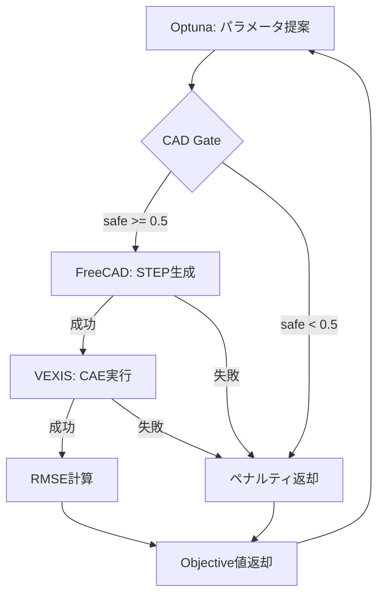

# Proto4: CAD Feasibility-Gated Optimization

## 最終ゴール

**CAD成立性を事前予測してから最適化を行う、効率的なCAE最適化パイプライン**

従来のプロセス（proto1-3）では、すべてのパラメータ組み合わせに対してFreeCAD + VEXISを実行していた。Proto4では **MLモデル（ai-v0）でCAD成立性を事前予測** し、失敗する可能性が高いパラメータを **CAE実行前にスキップ** することで、計算コストを大幅に削減する。

```
┌─────────────────────────────────────────────────────────────────┐
│                     Proto4 最適化フロー                          │
├─────────────────────────────────────────────────────────────────┤
│                                                                 │
│  Optuna Sampler ──▶ CAD Gate (ai-v0) ──▶ FreeCAD ──▶ VEXIS     │
│       │                  │                  │          │        │
│       │              ML予測              STEP生成    CAE実行    │
│       │                  │                  │          │        │
│       │              ✗ 失敗予測 ─┐         │          │        │
│       │                         │         │          │        │
│       ◀── ペナルティ値で返却 ◀─┘         ▼          ▼        │
│       ◀────────────────────────── Objective値で返却          │
│                                                                 │
└─────────────────────────────────────────────────────────────────┘
```

## アプローチ

### 1. CAD Feasibility Gate（CAD成立性ゲート）

ai-v0 SafetyPredictorを使用して、20次元の寸法比率からCAD成立性を予測。

| 入力                            | 出力                |
| ------------------------------- | ------------------- |
| 20次元比率ベクトル (0.78〜1.22) | safe確率 (0.0〜1.0) |

閾値（デフォルト0.5）未満の場合は「infeasible」として **CAEをスキップ** し、ペナルティ値を返す。

### 2. FreeCAD連携（GeometryAdapter）

FreeCADをヘッドレスで実行し、スケッチ制約を更新→STEP出力。

**実装済み機能:**
- FCStdファイル読み込み
- 20制約の比率ベース更新
- recompute + 形状検証
- STEPエクスポート

### 3. VEXIS連携（CaeEvaluator）

生成されたSTEPファイルをVEXISで解析し、目標曲線とのRMSEを計算。

### 4. Optuna最適化

TPE/AutoSamplerを使用した効率的な探索。FeasibilityAwareSamplerでinfeasible点を学習。

## パイプライン詳細



## モジュール構成

```
src/proto4-claude/
├── runner.py          # CLIエントリポイント
├── config.py          # 設定読み込み
├── cad_gate.py        # ML予測ゲート (ai-v0連携)
├── freecad_engine.py  # FreeCAD操作エンジン
├── geometry_adapter.py # STEP生成アダプタ
├── cae_evaluator.py   # VEXIS実行ラッパー
├── objective.py       # 目的関数オーケストレータ
├── search_space.py    # Sampler/制約
├── persistence.py     # 結果保存
└── types.py           # データ型定義
```

## 20次元パラメータ

ai-v0モデルが期待する特徴量名（FreeCAD制約名と一致）:

| #   | パラメータ名       | 説明               |
| --- | ------------------ | ------------------ |
| 1   | CROWN-D-L          | クラウン直径(左)   |
| 2   | CROWN-D-H          | クラウン直径(高)   |
| 3   | CROWN-W            | クラウン幅         |
| 4   | PUSHER-D-H         | プッシャー直径(高) |
| 5   | PUSHER-D-L         | プッシャー直径(左) |
| 6   | TIP-D              | チップ直径         |
| 7   | STROKE-OUT         | ストローク外       |
| 8   | STROKE-CENTER      | ストローク中心     |
| 9   | FOOT-W             | フット幅           |
| 10  | FOOT-MID           | フット中央         |
| 11  | SHOULDER-ANGLE-OUT | ショルダー角度外   |
| 12  | SHOULDER-ANGLE-IN  | ショルダー角度内   |
| 13  | TOP-T              | トップ厚さ         |
| 14  | TOP-DROP           | トップドロップ     |
| 15  | FOOT-IN            | フット内           |
| 16  | DIAMETER           | 直径               |
| 17  | HEIGHT             | 高さ               |
| 18  | TIP-DROP           | チップドロップ     |
| 19  | SHOUDER-T          | ショルダー厚さ     |
| 20  | FOOT-OUT           | フット外           |

各パラメータは **基準値に対する比率** (0.8〜1.2) で探索。

## 現在の状況

| コンポーネント | 状態                           |
| -------------- | ------------------------------ |
| ai-v0 CAD Gate | ✅ 実装・テスト済み             |
| FreeCAD連携    | ✅ 実装・e2eテスト済み          |
| VEXIS連携      | ✅ 実装・テスト済み（77テスト） |
| Optuna統合     | ✅ 74テストパス                 |

## 次のステップ

1. ~~**VEXIS連携テスト** - 実CAE実行の検証~~ ✅
2. **フルパイプライン実行** - 10トライアルでend-to-end確認
3. **収束性テスト** - 100トライアルで最適化動作確認

---

## 失敗時のOptuna連携

CAD GateまたはFreeCADで失敗した場合のデータフロー:

| 失敗タイプ   | Objective値      | Violation Score  | 効果                  |
| ------------ | ---------------- | ---------------- | --------------------- |
| CAD Gate失敗 | ペナルティ(50.0) | 1.0 - confidence | TPEが避ける領域を学習 |
| FreeCAD失敗  | ペナルティ(50.0) | 1.0              | TPEが避ける領域を学習 |
| CAE失敗      | ペナルティ(50.0) | -1.0 (CAD成功)   | CADは成功として扱う   |

**Feasibility Violation Score** は `trial.user_attrs["proto4_feasibility_violation"]` に保存され、TPEの `constraints_func` で読み取られる。

---

## 開発履歴 (2026-02-09〜10)

### Phase 1: 既存実装の調査
- `proto4-claude/` の構造確認（71テストパス）
- `GeometryAdapter` と `CadGate` がTODO状態であることを確認
- `cad-automaton` リポジトリの `ai-v0` モデルと `proto3-hybrid` のFreeCAD連携コードを調査

### Phase 2: ai-v0 SafetyPredictor統合
- `cad_gate.py` に `SafetyPredictorWrapper` を追加
- ディレクトリパス（model.joblib + scaler.joblib）を自動検出してロード
- 20次元特徴量を `AI_V0_FEATURE_NAMES` で定義
- 統合テスト3件追加、全74テストパス

### Phase 3: FreeCAD連携実装
- `freecad_engine.py` を新規作成（proto3-hybridから移植）
  - `_get_freecad()`: conda環境からFreeCADをロード
  - `apply_ratios()`: 制約値を比率で更新
  - `export_step()`: STEP出力
- `geometry_adapter.py` を実装済みに更新
- `config.py` に `surface_name/surface_label` を追加
- `proto4_limitations.yaml` を20次元パラメータに拡張

### Phase 4: End-to-Endテスト
- `ref-fcad/TH1-ref.FCStd` をテストファイルとして使用
- fcad conda環境でFreeCAD直接実行テスト
- 20制約すべてがai-v0特徴量名と一致することを確認
- 制約変更(ratio=1.05) → recompute → STEP出力成功

### 課題と解決
| 課題                               | 解決策                             |
| ---------------------------------- | ---------------------------------- |
| pytestがシステムPythonを使用       | fcad環境のpython.exeで直接実行     |
| proto3のCadEditorがスケルトン      | proto3-hybridからFreecadEngine移植 |
| ai-v0の20次元とproto4の2次元不一致 | 設定ファイルを20次元に拡張         |

### Phase 5: VEXIS連携テスト (2026-02-10)
- `tests/proto4/test_vexis_integration.py` を新規作成
  - 環境テスト: VEXISディレクトリ構造確認（4テスト）
  - CSVロードテスト: 既存結果ファイル読み込み確認
  - 統合テスト: FEBioによる実CAE実行（slowマーク付き）
- FEBioチェックフィクスチャを追加（未インストール時はスキップ）
- 全77テスト体制（.venv環境で72パス + VEXISテスト5パス）


