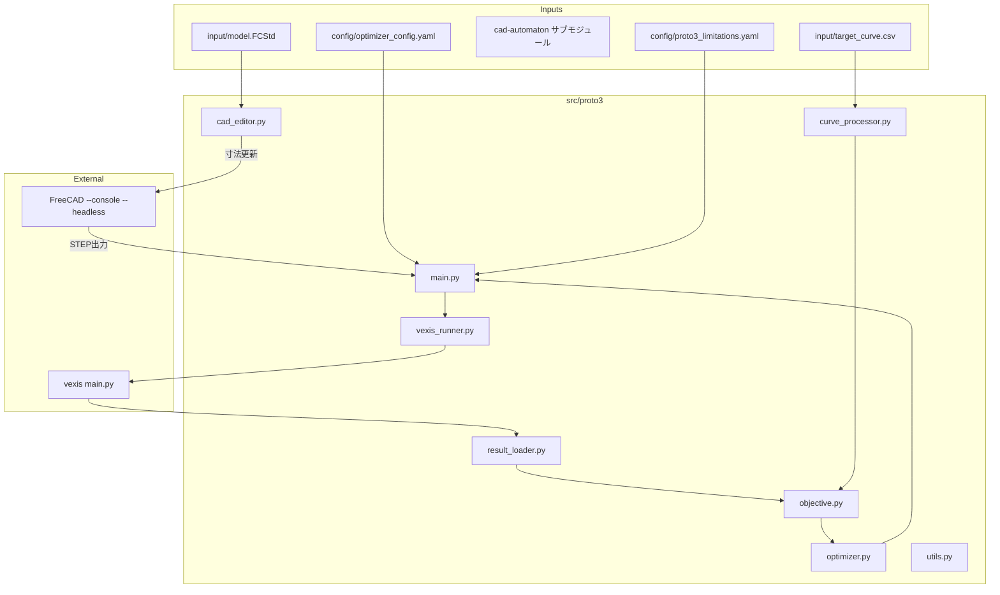

# Proto3 寸法最適化 + VEXIS 連携 設計書

## 1. 概要

Proto3は、FreeCADのヘッドレス起動で単一スケッチ内の寸法拘束値を変更し、
STEPを出力してVEXIS解析を行い、Optunaで目的関数を最小化するプロトタイプです。

- 最適化対象: OGDEN係数ではなく FreeCADスケッチの寸法拘束値
- ワークフロー: 変更→STEP出力→VEXIS解析→Optuna評価→次の入力
- FreeCAD連携: 既存プロトタイプ（cad-automaton）をサブモジュールとして参照
- VEXIS/Optuna周辺: Proto2のコードを極力流用
- エラーハンドリング: 失敗ケースはスキップし最適化は継続

## 2. Proto2との違い

| 項目 | Proto2 | Proto3 |
| --- | --- | --- |
| 最適化対象 | OGDEN材料係数 | FreeCADスケッチの寸法拘束値 |
| 入力形状 | 固定STEP | FreeCADから動的にSTEP生成 |
| 形状更新 | なし | FreeCADヘッドレスで寸法更新 |
| 解析ワークフロー | 材料更新→VEXIS | 寸法更新→STEP出力→VEXIS |
| サブモジュール | vexis | vexis + cad-automaton |

## 3. 目標要件

1) FreeCADヘッドレス実行で指定スケッチの拘束寸法を更新
2) STEPを出力し、VEXIS解析を回す
3) Optunaが結果に基づき次の寸法候補を生成
4) 解析失敗や寸法変更失敗は「その試行のみ失敗」として扱い、最適化継続
5) Proto2の VEXIS/Optuna ロジックを極力流用

## 4. アーキテクチャ



## 5. ディレクトリ構成（予定）

```
optuna-for-vexis/
├── src/
│   ├── proto2/                # 既存
│   └── proto3/
│       ├── main.py             # エントリポイント
│       ├── cad_editor.py       # FreeCAD連携 (cad-automaton参照)
│       ├── vexis_runner.py     # proto2から流用
│       ├── result_loader.py    # proto2から流用
│       ├── objective.py        # proto2から流用
│       ├── optimizer.py        # proto2から流用
│       ├── curve_processor.py  # proto2から流用
│       ├── utils.py            # proto2から流用
│       └── DESIGN.md           # 本設計書
├── config/
│   ├── optimizer_config.yaml
│   └── proto3_limitations.yaml
├── input/
│   ├── model.FCStd
│   ├── target_curve.csv
│   └── (generated) step/
├── output/
└── cad-automaton/              # サブモジュール
```

## 6. FreeCAD連携方針

### 6.1 参照するサブモジュール

- cad-automaton: https://github.com/A6721jpn/cad-automaton
- 役割: FreeCADのヘッドレス起動、スケッチ拘束値の更新、STEP出力

### 6.2 想定API/流れ

Proto3では、cad-automatonの既存スクリプト/関数を直接呼び出すか、
CLI経由で実行することを想定する。

要件:
- 入力: FCStdファイルパス、対象スケッチ名、拘束名と値
- 出力: STEPファイルパス
- エラー時: 例外を上げる/非ゼロ終了 → Proto3側で捕捉

## 7. 最適化パラメータ

### 7.1 寸法拘束

- 最適化変数は「スケッチ拘束の寸法名 → 値」
- 例: constraint_map: {"Sketch001": {"Constraint1": [min, max], ...}}

### 7.2 範囲設定

`config/proto3_limitations.yaml` で管理

例:
```yaml
freecad:
  fcstd_path: "input/model.FCStd"
  sketch_name: "Sketch001"
  constraints:
    width: {min: 10.0, max: 20.0}
    height: {min: 5.0, max: 12.0}
  step_output_dir: "input/step"
  step_filename_template: "proto3_trial_{trial_id}.step"

cae:
  stroke_range:
    min: 0.0
    max: 0.5
```

## 8. 実行フロー

1) config/limitationsを読み込み
2) ターゲット曲線を処理
3) Optunaで寸法拘束値をサンプル
4) FreeCADで寸法更新 + STEP出力
5) VEXISでCAE解析
6) 結果CSVを読み込みRMSE計算
7) 失敗時は trial を fail/skip し、次の試行へ

## 9. エラーハンドリング設計

- FreeCAD失敗: trialを `inf` として返し最適化継続
- STEP出力なし: trialを `inf`
- VEXIS失敗: trialを `inf`
- 結果CSV欠損: trialを `inf`

*Proto3は最適化を止めない。失敗はログ記録のみ。*
## 9.1 失敗ペナルティ設計（推奨）

最適化が破綻寸法の近傍を避けられるよう、失敗時の目的関数に
距離ベースのペナルティを与えることを推奨する。

方針:
- 失敗時は `base_penalty + alpha * distance_from_valid` を返す
- `distance_from_valid` は範囲外量や最小厚み不足量など、計算可能な指標
- 距離が計算できない場合は固定ペナルティで代替

例:
- 制約範囲外: `distance = sum(max(0, min - x), max(0, x - max))`
- 幾何破綻: `distance = min_thickness_required - min_thickness_actual` (負なら0)

推奨スケール:
- RMSEが0〜1程度なら `base_penalty=10〜100` から開始
- 失敗理由別に重みを変える（寸法破綻 > FreeCAD失敗 > VEXIS失敗）

これにより Optuna のサンプラーが失敗領域を「悪い領域」と認識し、
近傍の探索回数を抑制できる。

## 10. 主要モジュール設計（Proto2流用ベース）

### 10.1 main.py

- Proto2 main.py をベースにする
- MaterialEditor を cad_editor に置換
- objective/curve_processor/result_loader/optimizer/vexis_runner は流用

### 10.2 cad_editor.py

責務:
- FreeCADヘッドレス起動
- 寸法拘束の更新
- STEP出力

I/O:
- Input: fcstd_path, sketch_name, constraints, output_path
- Output: step_path

### 10.3 vexis_runner.py

- Proto2のVexisRunnerを流用
- 入力STEPの配置先を FreeCAD出力のSTEPに合わせて調整

## 11. 開発準備タスク

1) cad-automatonをサブモジュールに追加
2) src/proto3/ ディレクトリ作成
3) proto3_limitations.yaml の設計
4) Proto2コードの流用ポイント整理

## 12. リスクと注意点

- FreeCADのヘッドレス実行環境
- スケッチ拘束名の不一致
- STEP出力が遅い/不安定な場合のタイムアウト
- VEXISの入出力とSTEPパスの整合

---


## 13. サブモジュール運用メモ（最新追従）

cad-automaton を常に最新に追従するため、以下の運用を想定する。

- 初回取得:
  - `git submodule update --init --recursive`
- 最新追従:
  - `git submodule update --remote --merge cad-automaton`
- 状態確認:
  - `git submodule status`

注意点:
- サブモジュールは参照コミットが固定されるため、最新追従には明示的な更新が必要。
- CIや他メンバーの環境でも同じ追従手順を共有する。\n*Document Version: 0.1*
*Created: 2026-01-28*


